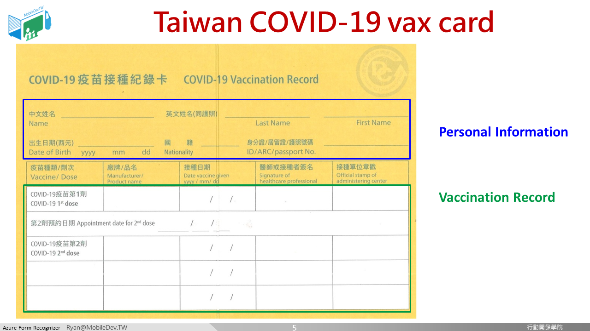

# 開發目標

## 把小黃卡上的接種紀錄數位化
* 接種次數
* 疫苗種類
* 接種日期
---
在必須檢查小黃卡的場合中，我們發現紙本小黃卡上的資訊是很雜亂的，印章、手寫、印刷...即便是由真人來檢視，有些時候也需要再三確認，耗時費工。

希望透過影像辨識的方式，快速將小黃卡資訊數位化，擷取出我們想要的次數、種類、日期三項資訊。 

本教學文件希望透過結合雲端AI服務來達成此目標。

---

小黃卡主要分成兩個部分：
* 上半部 : 個人資訊
* 下半部 : 接種紀錄(本次實驗主要針對的部分)

[[ 下一頁　Next Page ]](page2.md#top)
