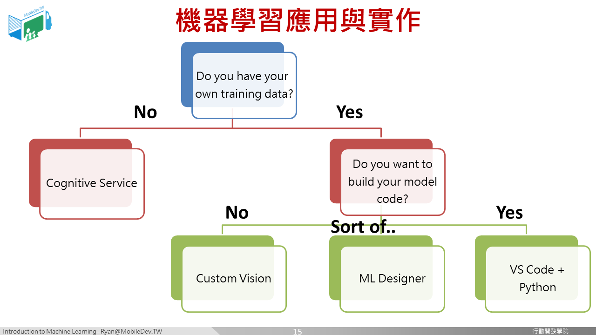

### 方法選擇

目前已經有許多現成的影像辨識模型，但仍可以自行進行開發，那什麼時候用現成的，什麼時候套用別人的比較合適呢? 我們可以用這兩個問題來探討:

1. 是否有自己的資料集?
2. 是否要進行程式開發?

#### 是否有自己的資料集?

如果當前的問題連自己的資料集都不需要的話，很有可能你的問題可以直接套用現成的服務。例如判斷是否是一隻貓、判斷是不是一顆蘋果等。但如果你想要做的是自家商品識別、特定一隻動物(我家的狗)這種題目，那麼市面上當然沒有人幫你做好它，就必須準備自己的資料集了。

以我們目前的題目來說，小黃卡是這一兩年才出現的特殊文件，國外現成模型肯定沒有，國內可能也還沒有人特別為了它製作模型，這時候，我們就必須準備一些資料來進行訓練。

#### 是否要進行程式開發?

如果公司內部已有機器學習工程師，當然可以直奔這個選項，開始進行程式開發。那麼目前市面上有沒有工具可以讓你放入自己的資料集來訓練模型呢? 非常多。如Google 的Cloud AutoML、Teachable Machine、Microsoft的Custom Vision Service，都是將圖片標註後，即可開始進行訓練，無須機器學習知識。

而以我們目前的例子來說，也有很多選擇，但是剛好Microsoft推出了一個針對表單文件識別的Azure Form Recognizer最接近我們當前的開發目標，所以選擇它來作為本次實驗的工具。

[[ 下一頁 Next Page ]](page3.md#form-recognizer-studio-介紹)