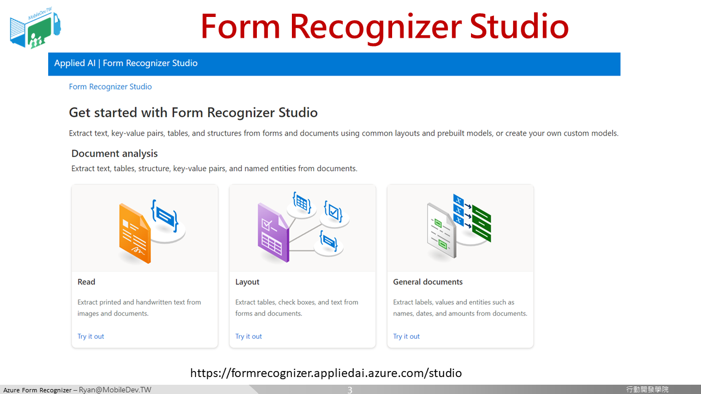
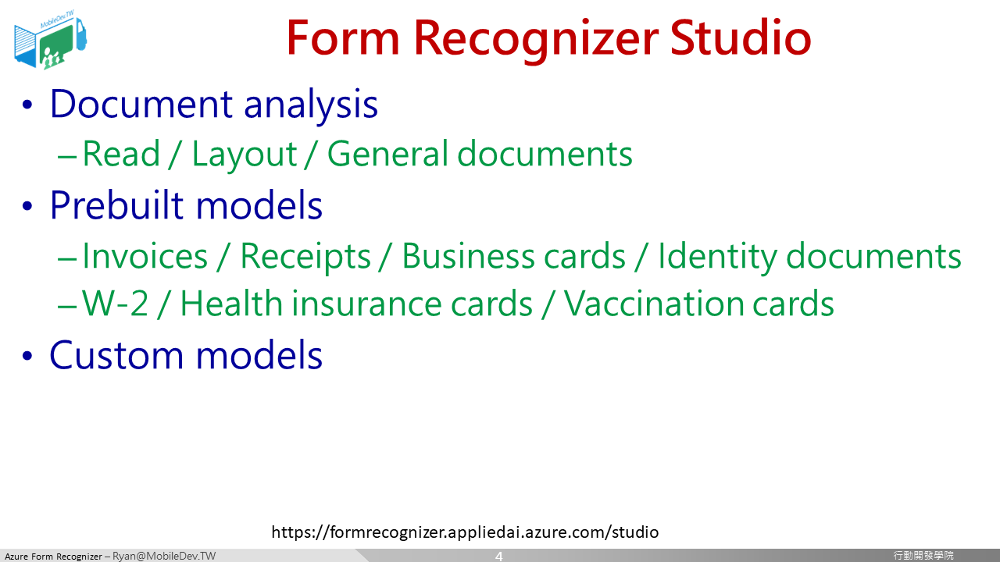
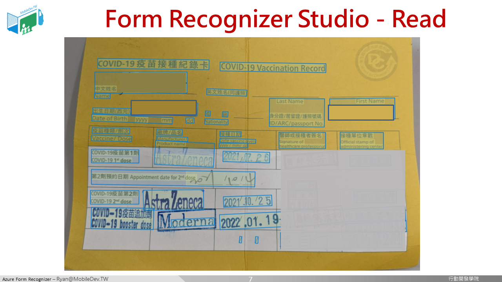
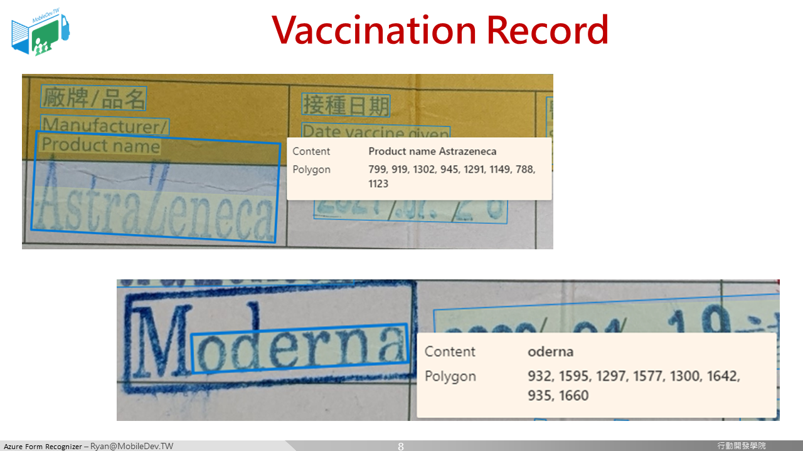
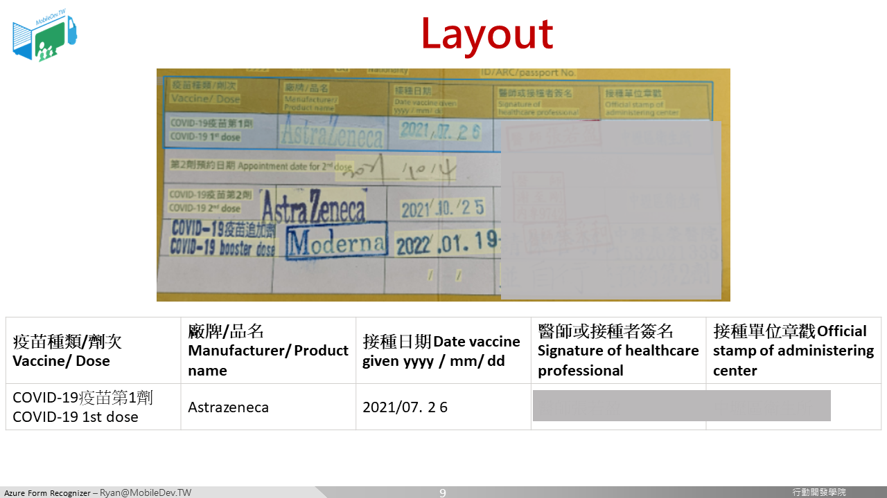

## Form Recognizer Studio 介紹

[Form Recognizer Studio](https://formrecognizer.appliedai.azure.com/studio
)是近期微軟為了Form Recognizer這項雲端AI服務所特別製作的網站，讓開發者在訓練模型的階段更容易上手。

在這個平台上，主要分為三大類 : 
* 文件分析 : 一般文件的文字識別
* 現成服務 : 美國常見文件格式(W2/保險卡/疫苗接種卡/身分證/收據)，都已有現成可使用的服務
* 客製化 : 自行打造一個合適的表單識別服務

我們先來試試第一種，文件分析，直接套用在小黃卡上是否合適。

其實效果還不錯，不論是印刷體、印章、手寫文字，大多可以辨識出來。

近距離看一下，也是有漏掉的(大M)，大部分都還不錯。但這個服務的缺點是，所有文字都是獨立的片段，即便辨識成功，後續維護會是一大問題。

讓我們再試一個看看 : 

這個現成的文件分析-Layout效果已經相當優秀，但可能是由於我們小黃卡的第二列太特殊了，所以表格辨識始終只能顯示第一列。

於是乎，我們必須進入第三種，客製化表單服務。

[[ 下一頁 Next Page ]](page4.md#客製化表單服務建立)