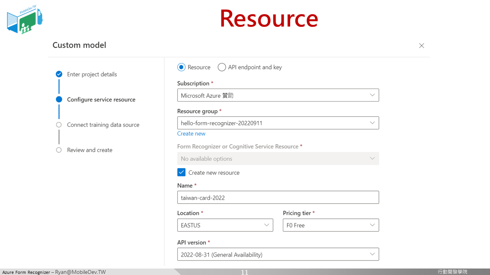

### 客製化表單服務建立

開始建立專案，輸入專案名稱與描述

選擇你的訂閱方案，資源群組，建立資源，設定資源名稱，區域，先選擇免費的(F0 Free)定價層，API版本就選當前最新的。

由於稍後要上傳訓練要用的圖片，所以會需要一個儲存的空間，要在這邊建立storage account(注意，這邊多多少少會產生一些費用，看上傳的照片大小而定)，大部分都用預設值即可。

如果你跟我一樣看到這個畫面，就代表微軟可能還沒自動修正這個Bug，儲存空間與表單識別，兩邊被認定為不同網域，無法跨域存取。

官方網站很貼心(?)地提供了解決方式，必須到儲存帳戶那邊，在CORS設定的地方，加入Form Recognizer的[網址](https://formrecognizer.appliedai.azure.com/)，這個問題就會消失了。

儲存帳戶確認建立並解決問題之後，就可以開始上傳圖片跟標註了!我們會建立一個表格的資料區，取個名子，選擇動態(Dynamic)的形式。

開始教我們的模型，這一格是第一個疫苗的種類、這一格是第一個疫苗的日期，然後跳過第二列，繼續往下做。至少需要標註5張。

標註至少5張之後，即可開始訓練模型，順利完成後，即可開始測試!

在平台上即可上傳圖片或使用網址來進行測試，效果看起來不錯!

在Models這裡可以看見Model ID，稍後串接API時會用到!

除了在平台上來測試已經訓練好的模型之外，我們也想讓模型與自己的網頁來結合!

[[ 下一頁 Next Page ]](page5.md#將模型與網頁結合)

