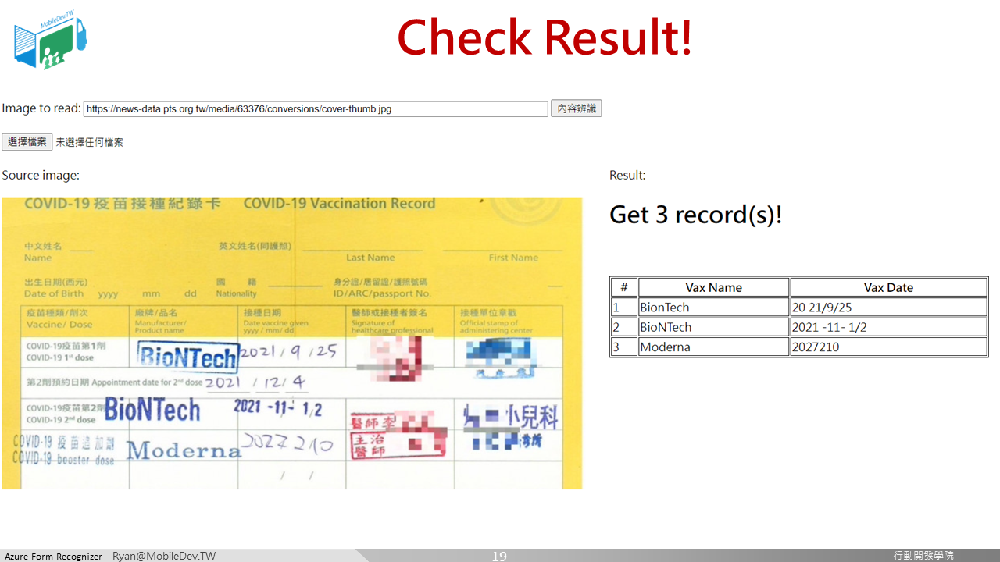
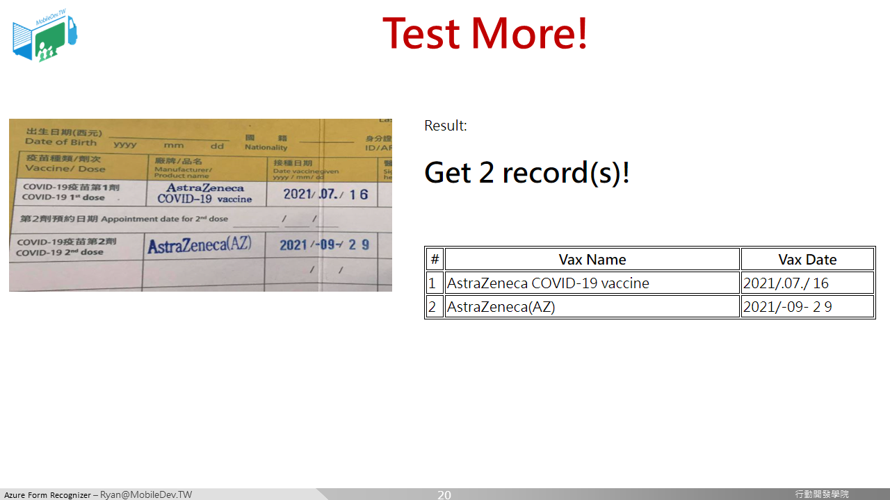
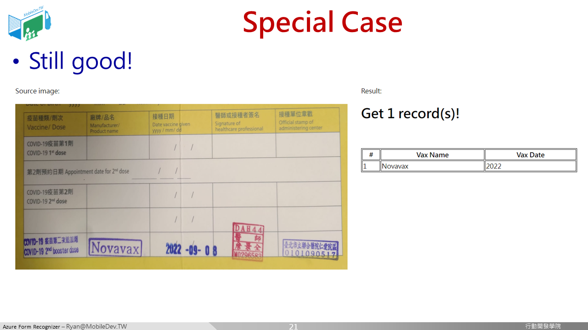
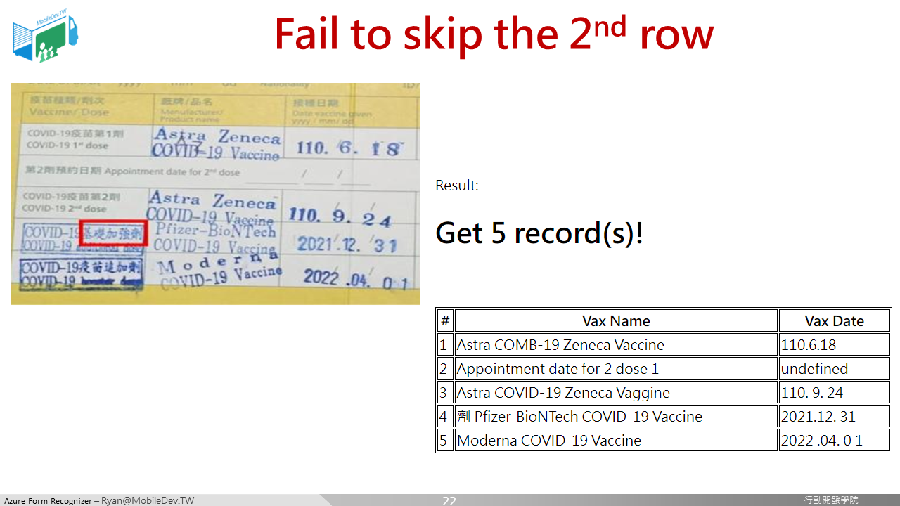

### 將模型與網頁結合

在這個專案中的src資料夾就是示範的網頁程式碼，主要包含 : 
* index.html : 介面，讓使用者輸入小黃卡圖片，產生辨識結果
* key.js : 要在這裡輸入在上一頁產生的模型的API Key
* main.js : 主要的程式邏輯
* style.css : 控制畫面樣式

由於在Form Recognizer階段已經將識別的結果結構化成表格了，所以這邊程式就可以比較輕鬆地從results裡面取出各筆資料的疫苗名稱(VaxName)與疫苗接種日期(VaxDate)，並且藉由計算results陣列的長度，即可獲得疫苗接種次數。

如果沒有Form Recognizer的話，在這邊就要把雜亂的識別結果，挑出想要的內容，而每一次，也可能因為識別結果的不一致，很難寫出一套通用的程式碼。

完成之後，來試試吧!

順利辨識出3筆!

順利辨識出2筆!

順利辨識出1筆!

當然，也是有出包的情況。

[[ 下一頁 Next Page ]](page6.md)