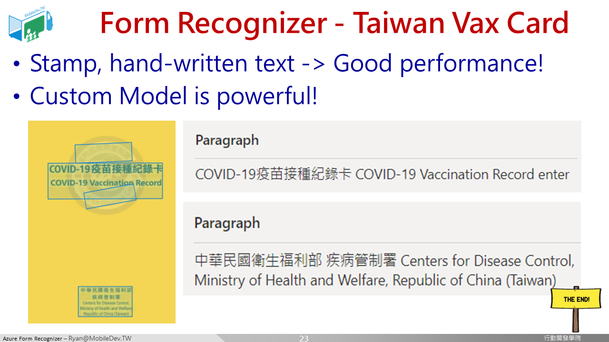

### 結果探討

基本上，其實Form Recognizer已經可以順利識別大部分的文字，不論是印刷體、印章文字、手寫文字。

但是透過客製化訓練，上傳小黃卡紀錄並進行標示後，能夠產生結構化的表單識別資料，在後續介接至應用程式時，可以省事許多! 

所以研發的第一步還是回歸於先釐清問題，盤點可能的解決方案，才能事半功倍!

[[ 回到首頁 Return to Home ]](README.md)